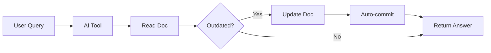
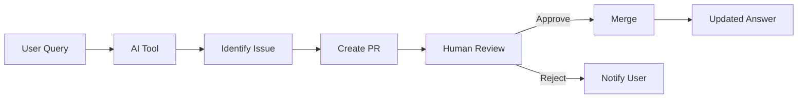

# AI-First Documentation Strategy

> **Paradigm Shift**: Documentation isn't something you read. It's something you query through AI, which reads, synthesizes, and even updates it for you.

## Background: The Journey to AI-First

### Starting Point: Docs-as-Code Seemed Perfect

We initially embraced docs-as-code (markdown files in Git repos) because it seemed ideal for the AI era:
- Plain text markdown is perfectly consumable by LLMs
- Git provides version control and history
- Engineers already work this way
- No vendor lock-in

### Then Reality Hit: The Access Problem

As we built out our docs-as-code implementation, complications emerged:

**"How does everyone access the content?"**
- Not everyone knows Git or wants to browse GitHub
- Solution explored: MkDocs to build a static website
- But this added complexity: CI/CD pipelines, hosting, maintenance

**"How do we handle cross-references and permalinks?"**
- Relative links break when docs move
- Links work differently in GitHub vs generated sites vs PDFs
- Solution explored: Complex link rewriting systems
- More complexity: Build scripts, redirect maps, broken link checkers

**"How do we manage AI-assisted editing?"**
- Claude Desktop can help write, but how does it commit changes?
- Users need Git knowledge to review AI suggestions
- Solution explored: Web-based editing tools, Git GUIs
- Even more layers between content and users

### The Revelation: AI IS the Interface

Then it clicked. We were solving the wrong problem. We kept asking "How do we make docs accessible to humans?" when we should have asked "Why do humans need direct access at all?"

**The Reality Check:**
- The vast majority of critical knowledge workers already use AI tools (Claude Desktop, Cursor, Copilot)
- They're already asking AI their questions
- AI can read Git repositories natively
- AI can write markdown perfectly

**The Simplification:**
- No static site needed - AI reads from Git directly
- No complex linking - AI understands document relationships
- No Git training - AI handles the commits
- No navigation - Natural language replaces clicking

### The Beautiful Solution: AI-First on Docs-as-Code

Docs-as-code remains the foundation - it's the perfect storage layer:
- Markdown for content (AI-native format)
- Git for version control (audit trail for AI edits)
- Pull requests for review (human oversight of AI changes)

But we flip the access model:
- **Before**: Git → Build Process → Website → Human
- **After**: Git ↔ AI Tools ↔ Human

The infrastructure we were building (static sites, link management, access control) becomes unnecessary. AI tools become the infrastructure. Documentation transforms from something you navigate to something that responds to you.

### The Bonus: Secondary Access Becomes Trivial

With AI-first, the "but what about users who don't use AI?" problem largely disappears:

**The minority who need direct access can use:**
- GitHub's native markdown rendering (already beautiful)
- A basic GitHub Pages site (one-click enable)
- Simple bookmarks to critical documents

**We don't need:**
- Sophisticated navigation systems (AI handles discovery)
- Advanced search (AI is the search)
- Complex information architecture (AI understands relationships)
- Responsive design for every device (AI works everywhere)
- Versioning UI (Git history is enough for the few who need it)

This isn't neglecting non-AI users - it's recognizing that when the majority of access is through AI, you can provide simple, good-enough solutions for the minority rather than over-engineering for an edge case. The effort previously spent on elaborate human-facing systems can be redirected to making the AI experience exceptional.

## Core Principle

**Traditional Docs**: Human writes → Human reads → Human updates  
**AI-First Docs**: Human writes → AI reads → AI answers human → AI updates → Human approves

Your documentation becomes a living knowledge graph that AI tools traverse, understand, and maintain.

## Why This Works Now

1. **Universal AI adoption**: Every employee has Claude Desktop or similar
2. **Natural language > Navigation**: Why click through folders when you can ask?
3. **Context awareness**: AI understands related documents better than humans
4. **Continuous improvement**: Each query can trigger updates

## Architecture

```
┌─────────────────────────────────────────┐
│          Git Repository                 │  ← Source of Truth
│  (Markdown + YAML frontmatter)          │
└────────────┬────────────────────────────┘
             │ Direct R/W Access
┌────────────▼────────────────────────────┐
│         MCP Server Layer                │  ← Intelligence Layer  
│  (Permissions, Validation, Indexing)    │
└────────────┬────────────────────────────┘
             │ Natural Language
┌────────────▼────────────────────────────┐
│    AI Tools (Claude, Cursor, etc.)      │  ← Interface Layer
│  (Chat, Code completion, Q&A)           │  
└────────────┬────────────────────────────┘
             │ Conversation
┌────────────▼────────────────────────────┐
│           Human Users                   │  ← Experience Layer
│  (Majority via AI, minority direct)     │
└─────────────────────────────────────────┘
```

## Document Structure for AI

### Metadata-Rich Frontmatter
```yaml
---
id: POL-SEC-001
title: Security Policy
version: 3.2.0
status: active
ai_instructions: |
  - Update statistics quarterly
  - Never modify sections marked regulatory
  - Flag changes to legal for review
ai_editable: true
ai_edit_constraints:
  - preserve_sections: [3, 4.2, 7]
  - require_human_approval: true
schema: policy/v2
last_ai_review: 2024-12-15
embeddings_generated: true
related_docs:
  - POL-DATA-001
  - GUIDE-SECURITY-001
---
```

### Semantic Markers
```markdown
<!-- AI-CONTEXT: This section describes PCI compliance requirements -->
## Payment Card Handling

<!-- AI-READONLY -->
All payment card data must be encrypted using AES-256.
<!-- /AI-READONLY -->

<!-- AI-UPDATEABLE: type=statistics, frequency=quarterly -->
Current compliance rate: 94% (Q4 2024)
<!-- /AI-UPDATEABLE -->

<!-- AI-EXAMPLE: Can be regenerated with current data -->
Example: When processing a payment...
<!-- /AI-EXAMPLE -->
```

## MCP Implementation Options

### Option A: Use Existing MCP Servers from Registry

The simplest approach leverages existing, reputable MCP servers from the official registry (launched September 2025):

**Available Servers for Docs-as-Code:**
- **GitHub MCP**: Direct repository access via GitHub API
- **Git MCP**: Local git operations (commit, push, pull)
- **Filesystem MCP**: Read/write local files
- **Google Drive MCP**: For organizations using Drive for some docs

**Configuration Example:**
```json
{
  "mcpServers": {
    "filesystem": {
      "command": "npx",
      "args": ["-y", "@modelcontextprotocol/server-filesystem", "/path/to/docs-repo"]
    },
    "github": {
      "command": "npx", 
      "args": ["-y", "@modelcontextprotocol/server-github"],
      "env": {
        "GITHUB_TOKEN": "${GITHUB_TOKEN}"
      }
    }
  }
}
```

**When to Use:**
- Standard documentation workflows
- Simple read/write operations
- Quick proof of concept
- Small to medium-sized teams

### Option B: Build Custom MCP Server

For organizations needing specialized functionality, a custom MCP server provides full control:

**When Custom is Necessary:**
- Complex permission models (different access per document type)
- Semantic search and indexing across multiple repos
- Custom validation and business logic
- Integration with proprietary systems
- Performance optimization for large-scale deployments

### Custom MCP Server Design (If Needed)

### Custom Core Capabilities (Example)
```javascript
class AIFirstDocsMCP {
  constructor() {
    this.capabilities = {
      read: true,
      write: true,
      search: true,
      validate: true,
      suggest: true,
      audit: true
    };
  }

  async tools() {
    return [
      {
        name: 'query_knowledge',
        description: 'Search and synthesize from all docs',
        parameters: {
          query: 'string',
          include_context: 'boolean',
          max_sources: 'number'
        }
      },
      {
        name: 'update_document',
        description: 'Propose changes to a document',
        parameters: {
          document_id: 'string',
          changes: 'array',
          justification: 'string'
        }
      },
      {
        name: 'validate_information',
        description: 'Check if information is current',
        parameters: {
          claim: 'string',
          document_context: 'string'
        }
      },
      {
        name: 'suggest_improvements',
        description: 'Analyze docs for updates needed',
        parameters: {
          scope: 'string',
          check_type: 'enum'
        }
      }
    ];
  }
}
```

### Hybrid Approach (Recommended)

Most organizations will benefit from combining existing MCPs with light customization:

**1. Start with Registry MCPs:**
```json
{
  "mcpServers": {
    "filesystem": "@modelcontextprotocol/server-filesystem",
    "github": "@modelcontextprotocol/server-github"
  }
}
```

**2. Add Validation Layer:**
```javascript
// git-hooks/pre-commit-ai-validation
const validateAIChanges = (files) => {
  // Check permissions
  // Validate content
  // Flag for review if needed
};
```

**3. Custom Tools Only Where Needed:**
```javascript
// Custom tool for specific business logic
{
  name: 'check_compliance',
  description: 'Verify document meets regulatory requirements',
  // This might warrant a custom MCP server
}
```

### Write Permissions Model
```yaml
# .github/ai-permissions.yaml
policies:
  default:
    read: true
    write: false
    
  rules:
    - path: 'prompts/**'
      write: true
      auto_merge: true
      
    - path: 'cheatsheets/**'
      write: true
      requires_review: true
      
    - path: 'policies/**'
      write: true
      requires_review: true
      reviewers: ['@compliance-team']
      
    - path: 'policies/**/regulatory-*'
      write: false  # Never allow AI edits
```

## Choosing Your MCP Strategy

### Decision Framework

**Start with Existing MCPs if:**
- Your documentation is in GitHub/GitLab
- You use standard markdown files
- You have typical read/write/review workflows
- You want to prototype quickly
- Your team is under 100 people

**Consider Custom MCP if:**
- You have multiple documentation repositories with complex relationships
- You need field-level permissions (some parts of docs editable, others not)
- You want sophisticated semantic search across documents
- You have proprietary validation requirements
- You're serving 1000+ users
- Performance is critical (caching, indexing)

**Hybrid Approach (Most Common):**
1. Use filesystem/GitHub MCPs for basic operations
2. Add git hooks for validation
3. Build small custom tools for specific needs
4. Consider custom MCP only when you hit real limitations

### Implementation Comparison

| Aspect | Registry MCPs | Custom MCP |
|--------|--------------|------------|
| Setup Time | Hours | Weeks |
| Maintenance | Minimal | Ongoing |
| Flexibility | Limited | Full |
| Security | Community-tested | Your responsibility |
| Cost | Free/Low | Development time |
| Scalability | Depends on server | You control |

## AI Edit Workflows

### Immediate Update (Low Risk)


### Reviewed Update (High Risk)


## Prompt Engineering for Docs

### Document Templates with AI Instructions
```markdown
---
template: policy
ai_generation_prompt: |
  When creating a new policy, include:
  1. Clear purpose statement
  2. Scope definition
  3. Specific requirements (numbered)
  4. Compliance section
  5. Related documents
---

# [Policy Title]

## Purpose
[AI: Write 2-3 sentences explaining why this policy exists]

## Scope  
[AI: Define who and what systems this applies to]

## Requirements
[AI: Generate numbered list based on input]

<!-- AI-INSTRUCTION: Always update this date -->
*Last Updated: YYYY-MM-DD*
```

### Self-Improving Prompts
```yaml
# prompts/customer-service.yaml
prompt: |
  You are a helpful customer service agent...
  
performance_metrics:
  satisfaction_score: 4.2
  average_resolution_time: 5m
  
ai_optimization_notes: |
  - Users respond better to empathetic opening
  - Include ticket number in first response
  - Suggest these improvements in next revision
```

## Implementation Phases

### Phase 1: Read-Only AI Access (Week 1-2)
**Using Existing MCPs:**
- Install filesystem MCP for local repo access
- Configure GitHub MCP for remote repos
- Enable querying through Claude Desktop
- Track what users ask about

**Custom MCP Considerations:**
- Only if existing MCPs don't meet needs
- Start with requirements gathering
- Prototype with existing tools first

### Phase 2: Assisted Updates (Week 3-4)
**Using Existing MCPs:**
- Filesystem MCP for edits
- Git hooks for validation
- Manual or scripted PR creation
- Human reviews all changes

**Custom MCP Additions:**
- Add permission layer if needed
- Implement business-specific validation
- Create audit logging

### Phase 3: Autonomous Zones (Month 2)
**Hybrid Approach:**
- Use existing MCPs for file operations
- Add custom validation scripts
- Certain paths allow direct AI updates
- Automatic quality checks via git hooks
- Rollback capabilities in git

### Phase 4: Self-Maintaining Docs (Month 3+)
- AI proactively identifies outdated content (custom or existing MCP)
- Suggests consolidation of redundant docs
- Generates examples from real usage
- Maintains cross-references
- Consider custom MCP only if scale demands it

## Quality Control for AI Edits

### Pre-Commit Validation
```python
# .github/hooks/pre-commit-ai
def validate_ai_changes(files_changed):
    for file in files_changed:
        doc = parse_document(file)
        
        # Check: No hallucinated references
        verify_all_links_exist(doc)
        
        # Check: Regulatory sections unchanged
        verify_protected_sections(doc)
        
        # Check: Dates are reasonable
        verify_temporal_consistency(doc)
        
        # Check: No PII introduced
        scan_for_sensitive_data(doc)
        
        # Check: Style consistency
        verify_style_guide_compliance(doc)
```

### AI Change Attribution
```bash
# Git commits from AI include metadata
git commit -m "Update AWS spending limits

AI-Tool: Claude-Desktop-3.5
AI-User: john@company.com  
AI-Confidence: 0.92
AI-Sources: [POL-FIN-003, POL-AWS-001]
AI-Validation: Passed"
```

## Fallback for Non-AI Users

### Minimal Static Site
```yaml
# mkdocs.yml - simplified for minority of direct users
site_name: Company Docs (Direct Access)
nav:
  - Critical Policies: policies/
  - Emergency Procedures: emergency/
  
# Just the essentials, no fancy features
```

### GitHub Native
- Most non-AI users can just use GitHub's native markdown rendering
- Bookmarks to specific files
- GitHub's search for finding docs

## Success Metrics

### AI-First Metrics
- **Query resolution rate**: % answered without human help
- **Update velocity**: Time from identifying outdated → updated
- **AI edit accuracy**: % of AI PRs approved without changes
- **Knowledge coverage**: % of queries with relevant docs

### Traditional Metrics (Secondary)
- Direct GitHub views (expected to decline)
- Static site visits (minimal)

## Migration Strategy

### From Current Docs-as-Code
1. Add AI metadata to existing docs
2. **Explore MCP Registry** for existing servers
3. Deploy chosen MCP configuration
4. Train pilot group on Claude Desktop
5. Monitor AI interactions
6. Gradually enable write permissions
7. Phase out static site when usage drops significantly

## Leveraging the MCP Ecosystem

### Official MCP Registry (September 2025)

The MCP Registry (registry.modelcontextprotocol.io) provides a growing catalog of production-ready servers:

**For Documentation:**
- `@modelcontextprotocol/server-filesystem` - Local file access
- `@modelcontextprotocol/server-github` - GitHub repository access
- `@modelcontextprotocol/server-gitlab` - GitLab repository access
- `@modelcontextprotocol/server-gdrive` - Google Drive documents

**For Related Systems:**
- Database servers (Postgres, MySQL)
- Communication tools (Slack, Discord)
- Project management (Linear, Notion)

**Advantages of Registry Servers:**
- Community-tested and maintained
- Regular security updates
- Standardized configuration
- Documentation and examples
- Quick to deploy

**When to Look Beyond Registry:**
- Proprietary document formats
- Custom permission models
- Specialized compliance requirements
- Performance optimization needs

### Recommended Starting Stack

For most AI-first documentation implementations:

```json
{
  "mcpServers": {
    "docs-local": {
      "command": "npx",
      "args": ["-y", "@modelcontextprotocol/server-filesystem", "./docs"]
    },
    "docs-remote": {
      "command": "npx",
      "args": ["-y", "@modelcontextprotocol/server-github"],
      "env": {
        "GITHUB_TOKEN": "${GITHUB_TOKEN}",
        "REPO": "org/documentation"
      }
    }
  }
}
```

This provides everything needed for AI to read, write, and manage documentation without custom development.

## Example User Experience

### Developer needing AWS info
```
User: "What's our AWS spending limit for dev environments?"

Claude Desktop: [Reads from Git via MCP]
"Dev environments have a $500/month limit per AWS spending policy. 
I notice this was last updated 6 months ago. Should I check if this 
is still current with the finance team?"

User: "Yes, I think it's $750 now"

Claude Desktop: [Creates PR]
"I've created PR #234 to update the limit to $750. Tagged 
@finance-team for review. Meanwhile, would you like me to 
document your current AWS usage?"
```

## The Revolutionary Part

Documents stop being static artifacts and become:
1. **Training data** for your AI assistant
2. **Dynamic knowledge** that updates through usage  
3. **Validated truths** via Git history and review
4. **Living memory** for the organization

This isn't just docs-as-code. It's **docs-as-intelligence**.

---

*This document itself is AI-first: optimized for AI parsing, including clear structure and semantic markers for intelligent processing.*

**Version:** 2.0.0  
**Last Updated:** September 2025  
**Key Change:** Added MCP Registry option alongside custom MCP development path
