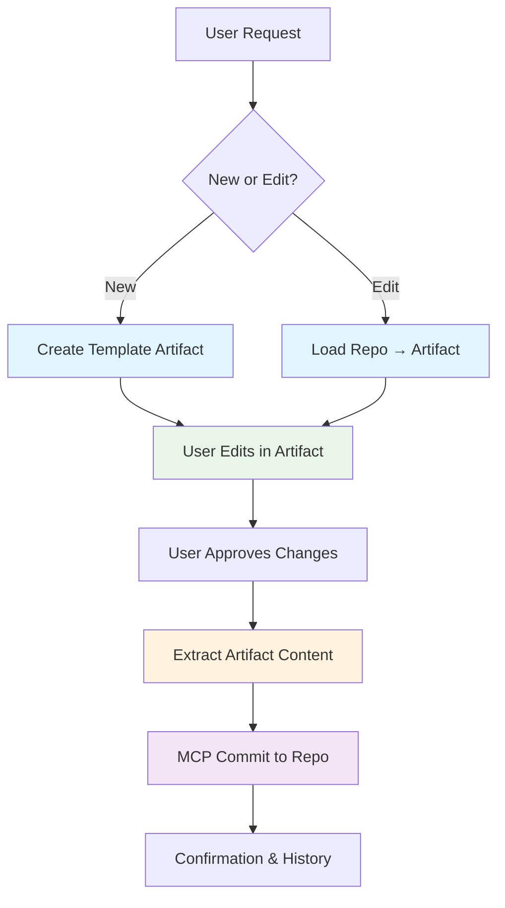

# MCP Architecture Planning

> **Status**: Planning Phase
> **Last Updated**: 2025-09-26
> **Decision Status**: Analysis Complete - Pending Implementation

## Executive Summary

This document captures the analysis and decision process for implementing Model Context Protocol (MCP) integration to enable AI-first documentation workflows. After evaluating existing MCP servers vs custom development, we've identified a phased approach starting with existing MCPs and evolving based on specific needs.

## Requirements Analysis

### Initial Assumptions

- Started with assumption that existing MCP servers would suffice
- Focused on single repository, technical users scenario
- Underestimated complexity of enterprise requirements

### Evolved Requirements Through Analysis

#### 1. Content Scope Expansion

- **Initial**: Standard documentation (markdown files)
- **Actual**: Documentation + AI prompts + agent personas + workflows
- **Impact**: Multi-content type handling, but all can remain in markdown with frontmatter

#### 2. Multi-Repository Architecture

- **Requirement**: Multiple related repositories
  - `ai-first-docs/` - Documentation repository
  - `ai-prompts/` - Prompt library repository
  - `ai-agents/` - Agent personas repository
  - Additional workflow/template repositories
- **Challenge**: Cross-repo relationships, unified search, coordinated updates
- **Complexity Factor**: High - existing MCPs are single-repo focused

#### 3. Non-Technical User Base

- **Requirement**: Majority of users will be non-technical Claude.ai/Desktop users
- **Challenge**: Seamless authentication without technical GitHub setup
- **Initial Concern**: Complex SSO/auth infrastructure needed
- **Solution Discovery**: Individual Personal Access Tokens (PATs) per user

#### 4. User-Level Revision Tracking

- **Requirement**: All changes must be attributed to actual users, not service accounts
- **Initial Concern**: Complex custom attribution system needed
- **Solution Discovery**: Individual PATs provide native GitHub attribution
- **Result**: Git commits show real users, full audit trail maintained

### Final Requirements Matrix

| Requirement | Complexity | Existing MCP Support | Custom MCP Needed |
|-------------|------------|---------------------|-------------------|
| Markdown + frontmatter content | Low | ✅ Full support | ❌ Not needed |
| User attribution via PATs | Medium | ✅ Native GitHub | ❌ Not needed |
| Single repository operations | Low | ✅ Full support | ❌ Not needed |
| Multi-repository coordination | High | ❌ Limited | ✅ Significant value |
| Cross-repo search/relationships | High | ❌ Not supported | ✅ Significant value |
| Non-technical user onboarding | Medium | ⚠️ PAT setup required | ✅ Could simplify |

## Architecture Options

### Option A: Existing MCP Servers with Individual PATs

**Implementation:**

```json
{
  "mcpServers": {
    "docs-repo": {
      "command": "npx",
      "args": ["-y", "@modelcontextprotocol/server-github"],
      "env": {
        "GITHUB_TOKEN": "${USER_GITHUB_PAT}",
        "REPO": "cto4ai/ai-first-docs"
      }
    },
    "prompts-repo": {
      "command": "npx",
      "args": ["-y", "@modelcontextprotocol/server-github"],
      "env": {
        "GITHUB_TOKEN": "${USER_GITHUB_PAT}",
        "REPO": "cto4ai/ai-prompts"
      }
    }
  }
}
```

**Pros:**

- ✅ Immediate implementation (hours, not weeks)
- ✅ Community-tested, maintained solutions
- ✅ Native user attribution through GitHub
- ✅ Standard GitHub permissions model
- ✅ Zero custom development/maintenance

**Cons:**

- ❌ No cross-repo coordination
- ❌ Separate MCP connections per repo
- ❌ No unified search across repositories
- ❌ PAT setup burden on non-technical users
- ❌ Limited relationship understanding between repos

**Best For:**

- Proving AI-first concept quickly
- Small team validation
- Simple multi-repo scenarios

### Option B: Custom MCP Server

**Implementation:**

```javascript
class AIFirstDocsMCP {
  constructor() {
    this.repositories = [
      { name: 'docs', url: 'cto4ai/ai-first-docs' },
      { name: 'prompts', url: 'cto4ai/ai-prompts' },
      { name: 'agents', url: 'cto4ai/ai-agents' }
    ];
  }

  async tools() {
    return [
      {
        name: 'cross_repo_search',
        description: 'Search across all related repositories',
        parameters: { query: 'string', repos: 'array' }
      },
      {
        name: 'update_related_content',
        description: 'Update content with cross-repo awareness',
        parameters: { changes: 'array', validate_relationships: 'boolean' }
      }
    ];
  }
}
```

**Pros:**

- ✅ Unified interface across all repositories
- ✅ Cross-repo relationship understanding
- ✅ Coordinated updates across repos
- ✅ Could simplify user onboarding
- ✅ Custom business logic and validation
- ✅ Optimized for specific workflow patterns

**Cons:**

- ❌ Weeks/months of development time
- ❌ Ongoing maintenance burden
- ❌ Security responsibility
- ❌ Testing and reliability challenges
- ❌ Feature parity with existing solutions

**Best For:**

- Complex multi-repo workflows
- Large-scale deployments
- Specialized business requirements

### Option C: Hybrid Approach (Recommended)

**Phase 1: Existing MCP Validation**

- Deploy existing MCPs with individual PATs
- Test AI-first workflows with technical team
- Identify specific gaps and pain points
- Measure usage patterns and bottlenecks

**Phase 2: Targeted Custom Tools**

- Keep existing MCPs as foundation
- Add specific custom tools for identified gaps
- Focus on cross-repo coordination where needed
- Incremental improvement based on real usage

**Phase 3: Full Custom MCP (If Needed)**

- Migrate to custom MCP only if clear value demonstrated
- Retain existing MCP capabilities
- Focus custom development on unique requirements

## Authentication & User Management

### Individual PAT Approach

**User Onboarding Process:**

1. **GitHub Account Setup**
   - Create GitHub account (if needed)
   - Add to organization and appropriate teams
   - Set repository permissions based on role

2. **PAT Generation**
   - Generate Personal Access Token with required scopes
   - Document token management (rotation, expiry)
   - Provide secure token delivery method

3. **Claude Desktop Configuration**
   - Provide pre-configured MCP settings
   - User adds their PAT to configuration
   - Test connection and permissions

4. **Training & Documentation**
   - AI-first workflow training
   - Basic Git/GitHub concepts for non-technical users
   - Support and troubleshooting resources

**Advantages:**

- Native GitHub user attribution
- Standard GitHub permission model
- Individual accountability and audit trail
- No custom authentication infrastructure

**Challenges:**

- PAT setup complexity for non-technical users
- Token management and rotation
- Support burden for authentication issues

## Implementation Phases

### Phase 1: Proof of Concept (Week 1-2)

**Goal**: Validate AI-first approach with existing tools

**Tasks:**

- [ ] Set up existing MCP servers for single repository
- [ ] Configure Claude Desktop for technical team members
- [ ] Test basic AI-documentation workflows
- [ ] Document user experience and limitations
- [ ] Gather feedback on multi-repo coordination needs

**Success Criteria:**

- AI can read and update documentation successfully
- User attribution works through individual PATs
- Team can perform basic AI-first documentation tasks

### Phase 2: Multi-Repository Expansion (Week 3-4)

**Goal**: Extend to multiple repositories and broader team

**Tasks:**

- [ ] Configure MCP for additional repositories
- [ ] Develop user onboarding process for PAT setup
- [ ] Create training materials for non-technical users
- [ ] Implement git hooks for validation across repos
- [ ] Test cross-repo workflows and identify gaps

**Success Criteria:**

- Multiple repositories accessible through AI
- Non-technical users can complete onboarding
- Cross-repo coordination pain points identified

### Phase 3: Custom Tool Development (Month 2-3)

**Goal**: Address specific gaps identified in Phase 2

**Potential Custom Tools:**

- Cross-repository search and relationship mapping
- Coordinated updates across multiple repositories
- Simplified user onboarding and configuration
- Advanced validation and business logic

**Decision Criteria for Custom Development:**

- Clear business value demonstrated
- Existing solutions inadequate
- Development cost justified by usage/savings
- Team capacity for ongoing maintenance

## User Workflow: Policy Document Editing

This section details the exact user experience for editing a policy document through Claude Desktop with MCP integration, demonstrating how the AI-first approach eliminates technical complexity while maintaining full version control.

### Complete User Journey

#### Step 1: User Initiates Request

**User Experience:**

```text
User in Claude Desktop: "I need to update our vacation policy to include the new remote work guidelines"
```

**System State:**

- User has Claude Desktop with configured MCP connection
- User's Personal Access Token provides GitHub access
- No local Git repository or files required
- No technical knowledge of repository structure needed

#### Step 2: File Discovery via MCP

**User Experience:**

```text
Claude: "I found your vacation policy document in the repository. Let me read the current version first..."

Current Policy:
- 15 days PTO for new employees
- 20 days after 2 years
- 25 days after 5 years
- Must be approved 2 weeks in advance

What specific remote work guidelines would you like me to add?
```

**Technical Flow:**


**Behind the Scenes:**

- MCP searches repository contents for vacation/PTO/policy matches
- Identifies `docs/policies/vacation-policy.md` as most relevant
- Loads current content into Claude's context
- User sees existing policy without knowing file paths or Git commands

#### Step 3: Interactive Content Development

**User Experience:**

```text
User: "Add a section about remote work eligibility. Employees with 6+ months tenure can work remotely up to 2 days per week, with manager approval."

Claude: "Perfect! I'll add this as a new section. Here's how I propose to structure it:

## Remote Work Policy
- Eligible: Employees with 6+ months tenure
- Limit: Up to 2 days per week
- Approval: Manager approval required
- Guidelines: Must maintain communication standards

Should I add this after the PTO accrual section?"

User: "Yes, and also mention they need to be in good performance standing."

Claude: "Great addition! I'll include that requirement."
```

**System State:**

- All editing occurs in conversation context
- No local files created or modified
- Claude maintains full file content in memory
- User reviews and refines changes interactively

#### Step 4: Direct Repository Update via MCP

**User Experience:**

```text
Claude: "I've updated the vacation policy with the new remote work guidelines. The changes are now live in the repository. Here's what I added:

[Shows the exact changes made]

The policy is immediately available to all team members. Would you like me to:
1. Create a summary for announcing this policy update?
2. Check if other policies need similar remote work updates?
3. Review the change history?"
```

**Technical Flow:**


**Behind the Scenes:**

- Claude prepares complete updated file content
- MCP commits directly to repository via GitHub API
- Commit metadata includes user attribution and AI context
- No local Git operations required

#### Step 5: Verification and Follow-up

**User Experience:**

```text
Claude: "The vacation policy has been updated successfully. I can see the change in the repository history:

Commit: Update vacation policy with remote work eligibility guidelines
Author: jane.smith <jane.smith@company.com>
Date: 2025-09-26 10:30:00
Changes: Added remote work section with tenure and approval requirements

Is there anything else you'd like me to help with regarding this policy update?"
```

### Git Commit Example

**What appears in repository:**

```bash
commit a1b2c3d4e5f6789012345678901234567890abcd
Author: jane.smith <jane.smith@company.com>
Date: Thu Sep 26 10:30:00 2025 -0700

Update vacation policy with remote work eligibility guidelines

- Add remote work section for employees with 6+ months tenure
- Specify 2 days per week maximum with manager approval
- Include performance standing requirement
- Position after PTO accrual section for logical flow

AI-Tool: Claude Desktop via GitHub MCP
AI-Session: claude-desktop-20250926-103000
Original-Request: "Update vacation policy to include new remote work guidelines"
User-Refinements: Added performance standing requirement
```

### Key Workflow Characteristics

#### Zero Local Git Complexity


**What users DON'T need:**

- ❌ Local Git installation or configuration
- ❌ Repository cloning or syncing
- ❌ File system navigation
- ❌ Git command knowledge
- ❌ Branch management
- ❌ Merge conflict resolution
- ❌ Understanding of repository structure

**What users DO get:**

- ✅ Full version control and audit trail
- ✅ Real-time collaboration capability
- ✅ Professional Git commit history
- ✅ Individual attribution and accountability
- ✅ Rollback and history access
- ✅ Integration with existing GitHub workflows

#### Advanced Scenarios

**Branch and Pull Request Creation:**

```text
User: "I need to completely rewrite our security policy - this is a major change."

Claude: "Since this is a significant policy change, I recommend creating a branch and pull request for review. I'll:

1. Create a new branch: feature/security-policy-rewrite
2. Make the changes on that branch
3. Create a pull request for team review
4. Tag appropriate reviewers based on the policy type

This ensures proper oversight for major policy changes. Should I proceed?"

User: "Yes, and make sure to tag the security team for review."

Claude: "Perfect! I've created branch 'feature/security-policy-rewrite' and I'll tag @security-team as reviewers when I create the PR."
```

**Cross-Repository Updates:**

```text
User: "When I updated the vacation policy, I think our employee handbook might reference the old remote work rules."

Claude: "Let me check the employee handbook repository... I found two references that need updating:

1. In handbook/benefits/time-off.md - references old remote work policy
2. In handbook/quick-reference/policies.md - summary needs updating

Should I update both repositories to keep everything consistent?"
```

### Error Handling and Edge Cases

#### Permission Issues

```text
Claude: "I tried to update the policy, but it looks like you don't have write permissions to this repository. I can:

1. Create the changes as a draft for you to review
2. Help you request access from the repository admin
3. Create the changes in a fork if you have one

Which would you prefer?"
```

#### Conflict Resolution

```text
Claude: "It looks like someone else updated this file while we were working on it. The changes are:

[Shows conflicting changes]

I can:
1. Merge our changes with theirs automatically
2. Create a branch with our changes for manual review
3. Show you both versions so you can decide

What would you like me to do?"
```

#### Validation Failures

```text
Claude: "I've prepared the policy update, but the repository's validation checks found some issues:

- Spell check: 'eligibility' was misspelled as 'eligibilty'
- Link check: Reference to old policy URL is broken
- Markdown lint: Missing blank line after header

I can fix these automatically before committing. Should I proceed?"
```

## Decision Framework

### When to Stay with Existing MCPs

- ✅ Workflows function adequately with separate repo connections
- ✅ Team comfortable with multi-MCP configuration
- ✅ Cross-repo coordination needs are minimal
- ✅ PAT onboarding process proves manageable

### When to Develop Custom MCP

- ❌ Cross-repo workflows become major productivity bottleneck
- ❌ User onboarding becomes significant support burden
- ❌ Complex business logic requirements emerge
- ❌ Scale requires performance optimization

### Hybrid Indicators

- ⚠️ Some workflows benefit from custom tools
- ⚠️ Specific integration requirements
- ⚠️ Gradual improvement approach preferred
- ⚠️ Risk mitigation through incremental development

## Risk Assessment

### Existing MCP Risks

- **Low Technical Risk**: Community-maintained, tested solutions
- **Medium User Experience Risk**: Multi-repo configuration complexity
- **Medium Scalability Risk**: May not scale to complex workflows
- **Low Maintenance Risk**: External maintenance

### Custom MCP Risks

- **High Technical Risk**: Custom development, testing, security
- **Low User Experience Risk**: Optimized for specific workflows
- **Low Scalability Risk**: Built for requirements
- **High Maintenance Risk**: Ongoing development and support

## Next Steps

### Immediate Actions (This Week)

1. **Repository Setup**
   - Ensure all target repositories are properly configured
   - Set up team permissions and access controls
   - Prepare repository documentation and structure

2. **MCP Configuration**
   - Install and configure existing MCP servers
   - Create configuration templates for team members
   - Test basic functionality with technical team

3. **User Onboarding Design**
   - Design PAT generation and distribution process
   - Create onboarding documentation for non-technical users
   - Plan training sessions and support resources

### Short Term (Next 2-4 Weeks)

- Execute Phase 1 and Phase 2 implementation
- Gather comprehensive feedback on user experience
- Document specific gaps and improvement opportunities
- Make go/no-go decision on custom MCP development

### Long Term (2-3 Months)

- Based on Phase 2 results, implement custom tools or full MCP
- Scale to full organization deployment
- Optimize based on usage patterns and feedback
- Document lessons learned and best practices

## Artifact Integration Enhancement

Based on confirmed technical capabilities, Claude Desktop can extract artifact content and save as markdown files, enabling a powerful visual editing enhancement to the AI-first documentation workflow.

### Technical Feasibility Confirmed

**Claude's Artifact Capabilities:**

- ✅ **Content Extraction**: Claude can programmatically access artifact content
- ✅ **Markdown Export**: Claude can save artifact content as properly formatted markdown files
- ✅ **File System Access**: Claude can write extracted content to local or remote destinations

This confirms that bidirectional artifact ↔ repository integration is technically feasible.

### Enhanced User Workflow with Artifacts

#### Step-by-Step Artifact-Enabled Process

**1. Load Repository Content to Artifact**

```text
User: "Load the vacation policy into an artifact so I can edit it visually"

Claude: [Calls MCP to read file] → [Creates editable artifact with current policy content]

User sees: Rich, formatted document in artifact interface with proper headings, lists, and structure
```

**2. Visual Editing in Artifact**

```text
User: [Edits directly in artifact interface]
- Modifies text using rich formatting
- Adds new sections with proper structure
- Uses artifact's visual editing capabilities
- Sees real-time formatted preview
```

**3. Seamless Repository Commit**

```text
User: "This looks perfect! Commit the updated policy to the repository."

Claude:
1. Extracts artifact content as markdown ✅
2. Calls MCP server with extracted content ✅
3. Commits to repository with user attribution ✅
4. Confirms successful update ✅
```

### Custom MCP Server Enhancements Required

#### New MCP Tools for Artifact Integration

```javascript
{
  name: 'load_repo_to_artifact',
  description: 'Load repository content and create editable artifact',
  parameters: {
    file_path: 'string',
    artifact_type: 'enum', // policy, procedure, prompt, general
    template: 'string' // optional structured template
  }
},
{
  name: 'commit_artifact_to_repo',
  description: 'Extract artifact content and commit to repository',
  parameters: {
    artifact_reference: 'string', // however Claude references artifacts
    file_path: 'string',
    commit_message: 'string',
    validate_content: 'boolean' // run pre-commit validation
  }
},
{
  name: 'create_document_template',
  description: 'Generate structured artifact template for document type',
  parameters: {
    document_type: 'enum', // policy, sop, architecture, prompt
    metadata: 'object' // frontmatter fields to include
  }
}
```

### User Experience Benefits

#### Visual Editing Interface

- **Rich Formatting**: Headers, lists, tables, links rendered visually
- **Real-time Preview**: See exactly how document will appear
- **Structured Templates**: Form-based editing for consistent document structure
- **Multi-section Navigation**: Easy jumping between document sections

#### Seamless Version Control

- **Zero Git Complexity**: Visual editing with full version control
- **Professional Commits**: Proper attribution and commit messages
- **Change Visualization**: Before/after comparison in artifact interface
- **Instant Publishing**: Changes immediately available to team

#### Enhanced Productivity

- **Faster Editing**: Visual interface vs conversational back-and-forth
- **Reduced Errors**: Template validation and structured input
- **Collaborative Review**: Artifacts can be shared for feedback before commit
- **Content Templates**: Reusable templates for different document types

### Implementation Architecture

#### Artifact-Enhanced MCP Flow



#### Document Template System

**Policy Template Artifact:**

```yaml
# Artifact generates form-based interface
fields:
  - name: title
    type: text
    required: true
  - name: purpose
    type: textarea
    placeholder: "Why does this policy exist?"
  - name: scope
    type: textarea
    placeholder: "Who does this apply to?"
  - name: requirements
    type: list
    item_type: text
  - name: owner
    type: select
    options: [hr, security, engineering, legal]

# Auto-generates frontmatter:
frontmatter:
  id: POL-{auto-increment}
  type: policy
  owner: {selected_owner}
  created: {current_date}
  ai_editable: true
```

### Advanced Scenarios

#### Multi-Document Coordination

```text
User: "I updated the vacation policy artifact. Are there other documents that reference this?"

Claude:
1. Commits artifact changes to vacation policy ✅
2. Scans related repositories for references ✅
3. Creates artifacts for each document needing updates ✅
4. User reviews and approves cross-repo changes ✅
5. Commits coordinated updates across repositories ✅
```

#### Approval Workflow Integration

```text
User: "This is a sensitive policy change - create a PR for review"

Claude:
1. Extracts artifact content ✅
2. Creates feature branch ✅
3. Commits artifact content to branch ✅
4. Creates pull request with proper reviewers ✅
5. Provides PR link for team review ✅
```

### Implementation Phases

#### Phase 1: Basic Artifact Integration

- Implement `load_repo_to_artifact` and `commit_artifact_to_repo` tools
- Support simple markdown documents
- Single repository workflow
- Manual validation

#### Phase 2: Template System

- Document type templates (policies, procedures, prompts)
- Structured form-based artifact creation
- Automatic frontmatter generation
- Content validation integration

#### Phase 3: Advanced Features

- Cross-repository coordination
- Approval workflow integration
- Collaborative artifact sharing
- Advanced content templates

### Development Considerations

#### Technical Requirements

- **MCP Server Enhancement**: Custom tools for artifact integration
- **Content Validation**: Ensure artifact content meets repository standards
- **Error Handling**: Graceful failure when artifact extraction fails
- **Performance**: Efficient handling of large documents in artifacts

#### User Experience Design

- **Template Library**: Pre-built templates for common document types
- **Progressive Enhancement**: Works with or without artifact support
- **Fallback Mode**: Graceful degradation to conversational editing
- **Help System**: Guidance for artifact-based editing workflow

### Business Impact

#### Productivity Gains

- **Faster Content Creation**: Template-driven document generation
- **Reduced Training**: Visual interface vs Git command line
- **Higher Adoption**: Non-technical users can contribute effectively
- **Quality Improvement**: Structured templates ensure consistency

#### Risk Mitigation

- **Version Control Maintained**: Full Git history and attribution
- **Validation Preserved**: All existing quality checks still apply
- **Rollback Capability**: Standard Git revert operations available
- **Audit Trail**: Enhanced with artifact-specific metadata

This artifact integration represents a significant user experience enhancement that maintains all the benefits of the AI-first approach while providing a modern, visual editing interface comparable to traditional documentation tools.

## Appendix

### MCP Registry Resources

- [@modelcontextprotocol/server-filesystem](https://registry.modelcontextprotocol.io/packages/@modelcontextprotocol/server-filesystem)
- [@modelcontextprotocol/server-github](https://registry.modelcontextprotocol.io/packages/@modelcontextprotocol/server-github)

### GitHub PAT Scopes Required

- `repo` - Full repository access
- `read:org` - Organization membership (if needed)
- `user:email` - User email access for attribution

### Related Documents

- [AI-First Documentation Strategy](../ai-first-documentation-strategy.md)
- [Setup Guide](../setup-guide.md)
- [CLAUDE.md](../../../CLAUDE.md)

---

*This document will be updated as implementation progresses and new requirements are identified.*
