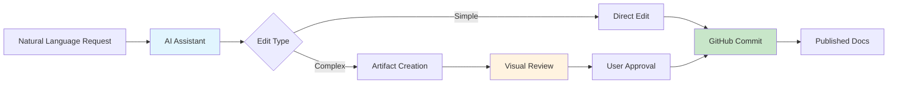

# 🤖 AI-First Documentation Template

> **Production-ready AI-first documentation system with GitHub integration and intelligent editing workflows**

[](https://github.com/cto4ai/ai-first-docs/generate)
[](LICENSE.md)
[](docs/examples/)

This template provides everything you need to implement **AI-first documentation practices** in your organization. Get a fully configured documentation repository with AI-powered editing, automated validation, and modern tooling.

## ✨ What Makes This AI-First?

- **🤖 AI Assistant Integration** - Pre-configured with AI instructions for intelligent document editing
- **📝 Artifact-Based Editing** - Visual document editing through AI interfaces
- **🔗 GitHub MCP Integration** - Direct repository editing through AI assistants
- **📋 Smart Templates** - AI-friendly document structures and examples
- **⚡ Instant Setup** - Repository ready for AI workflows from day one

## 🎯 Quick Start

### 1. Create Your Repository
[](https://github.com/cto4ai/ai-first-docs/generate)

1. Click **"Use this template"** above
2. Name your repository (e.g., `company-docs`, `product-documentation`)
3. Choose public or private
4. Click **"Create repository"**

### 2. Automatic Initialization
GitHub Actions will automatically:
- ✅ Replace template variables with your repository information
- ✅ Configure AI instructions for your organization
- ✅ Remove example content and create clean structure
- ✅ Create setup issue with your personalized next steps

### 3. Start AI-First Editing
Within minutes, you can:
- Ask AI to "Load the vacation policy into an artifact for editing"
- Request document updates: "Update the remote work policy to allow 4-day work weeks"
- Create new content: "Draft a code of conduct policy based on our company values"

## 📁 What You Get

### 🔄 **Automatic Setup** (2-3 minutes)
- **Personalized content** with your repository and organization information
- **AI instructions configured** for your organization context
- **Dependencies installed** and ready to use
- **GitHub Actions configured** for validation and publishing
- **Example content available** for reference and testing

### 📂 **Complete Structure**
```
your-new-docs-repo/
├── .claude/
│   └── DOCUMENT_ASSISTANT.md   # AI instructions for your organization
├── docs/
│   ├── policies/               # Your company policies
│   ├── procedures/            # SOPs and runbooks
│   ├── architecture/          # Technical documentation
│   └── examples/              # Reference examples (removable)
├── .github/workflows/         # CI/CD for validation & publishing
```

### 🚀 **AI-First Features**
- **Intelligent Content Generation** - AI creates and updates documentation
- **Visual Artifact Editing** - See changes before they're committed
- **Smart Search and Discovery** - AI finds relevant documents instantly
- **Automated Attribution** - Proper credit for AI-assisted changes
- **Context-Aware Editing** - AI understands your organization's style

## 🤖 AI-First Workflow Examples

### Basic Document Editing
1. **User**: "I need to update the vacation policy"
2. **AI**: Searches repository, finds policy file
3. **AI**: Loads content and asks what changes you need
4. **User**: Makes requests for changes
5. **AI**: Creates updated content and commits to repository

### Artifact-Enhanced Editing
1. **User**: "Load the vacation policy into an artifact for editing"
2. **AI**: Creates artifact with current policy content
3. **User**: Edits visually in artifact interface
4. **User**: "This looks good, commit it to the repository"
5. **AI**: Extracts artifact content and commits with proper attribution

### Content Creation
- **"Draft a code of conduct policy based on our company values"**
- **"Create a remote work policy allowing 4-day work weeks"**
- **"Update the expense policy to include new travel guidelines"**

## 📋 Example Content Included

This template includes example policies that demonstrate AI-first editing:

- **[Vacation Policy](docs/examples/policies/vacation-policy.md)** - PTO allocation and approval processes
- **[Remote Work Policy](docs/examples/policies/remote-work-policy.md)** - Flexible work arrangements
- **[Code of Conduct](docs/examples/policies/code-of-conduct.md)** - Professional standards with AI usage guidelines
- **[Expense Policy](docs/examples/policies/expense-reimbursement-policy.md)** - Business expense processes
- **[Pet Policy](docs/examples/policies/pets-in-office-policy.md)** - Office pet guidelines

## 🔧 Setup Requirements

### For AI Integration
- **GitHub Personal Access Token** with repository access
- **Claude Desktop** or compatible AI interface with MCP support
- **Organization-scoped PAT** for private repositories

See [setup guide](.github/DOCUMENTATION/setup-guide.md) for detailed instructions.

## 🛠️ Traditional Tools (Optional)

```bash
# Install dependencies
npm install

# Validate documentation
npm run validate

# Check spelling and links
npm run spell && npm run links

# Fix markdown formatting
npm run lint
```

## 📖 AI-First Philosophy

This template implements **AI-first documentation** principles:

- 🤖 **AI as Primary Editor** - Humans guide, AI executes
- 📋 **Artifact-Based Review** - Visual editing before commit
- 🔍 **Intelligent Discovery** - AI understands document relationships
- ⚡ **Rapid Iteration** - Quick updates through natural language
- 📊 **Quality Assurance** - Automated validation of AI changes
- 🎯 **Context Awareness** - AI understands organizational context

## 🏗️ Architecture



## 🤝 Contributing & Support

- **Issues**: [Report bugs or request features](https://github.com/cto4ai/ai-first-docs/issues)
- **Discussions**: [Community support and ideas](https://github.com/cto4ai/ai-first-docs/discussions)
- **Documentation**: See [AI-first strategy](.github/DOCUMENTATION/ai-first-documentation-strategy.md)

## 📄 License

This template is provided under the [MIT License](LICENSE.md). You may choose any license for your documentation repository.

---

**Ready to revolutionize your documentation workflow?**
[**Use this template →**](https://github.com/cto4ai/ai-first-docs/generate)

*Built with ❤️ for the AI-first documentation community*